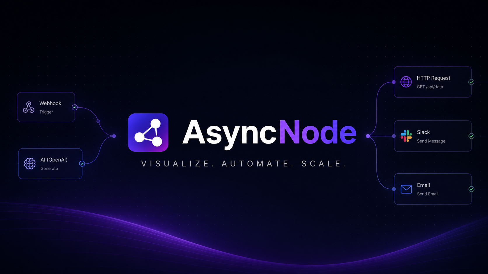

# AsyncNode

<p align="center">
  
</p>

<p align="center">
  <strong>Build, connect, and automate workflows visually.</strong><br>
  A self-hostable workflow automation platform powered by AI, HTTP APIs, webhooks, scheduled jobs, and real-time execution.
</p>

<p align="center">
  
  
  
  
  
</p>

---

## Features

- Visual drag-and-drop workflow builder
- AI integrations (OpenAI, Anthropic & Groq)
- HTTP Request node
- Email automation
- Slack integration
- Webhook triggers
- Scheduled workflows with BullMQ
- Execution history & per-node logs
- Live execution updates via WebSockets
- Secure authentication with email verification
- Self-hostable using Docker

---

## Quick Start

### Clone the repository

```bash
git clone https://github.com/devclub-nstru/Async_node.git
cd Async_node
```

### Start local services

```bash
cd docker
cp .env.example .env
docker compose -f docker-compose.dev.yml up
```

### Backend

```bash
cd app/server
cp .env.example .env
npm install
npm run dev
```

### Frontend

```bash
cd app/web
cp .env.example .env
npm install
npm run dev
```

Open your browser:

- **Frontend:** http://localhost:3000
- **Backend API:** http://localhost:8080
- **Swagger Docs:** http://localhost:8080/api/docs

## Tech Stack

### Frontend

- Next.js
- React
- TypeScript
- React Flow
- Tailwind CSS
- shadcn/ui

### Backend

- Node.js
- Express
- PostgreSQL
- Drizzle ORM
- BullMQ
- Redis
- Socket.IO
- Nodemailer
- JWT Authentication

### Infrastructure

- Docker
- Nginx
- GitHub Actions
- AWS EC2

---

## Contributing

We love contributions! To keep development organized, please follow this workflow.

1. Pick an open issue.
2. Request to be assigned to the issue.
3. Wait until a maintainer assigns the issue to you.
4. Fork the repository.
5. Create a feature branch.
6. Implement your changes.
7. Commit your changes with clear commit messages.
8. Open a Pull Request linked to the assigned issue.

> **Note**
>
> We only accept Pull Requests for **assigned issues**. This helps prevent duplicate work and ensures contributors aren't working on the same feature simultaneously.

---

## Contributors

Thanks to everyone who contributes to AsyncNode.

<p align="center">
  <a href="https://github.com/devclub-nstru/Async_node/graphs/contributors">
    
  </a>
</p>

---

## License

This project is licensed under the **MIT License**.
